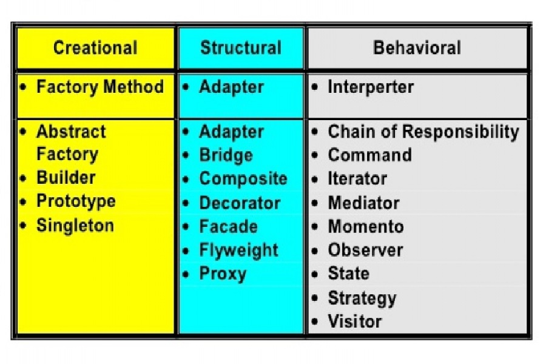

Whatever you're building, most of it, or most aspects of it, have been done before.  There are tried and true examples or templates that were and can be used to solve your problem.  My team and I built a marketplace type of webpage.  The backend design started with the schema or using terminology from the design patterns, a prototype.  This encapsulated what our Listings on the marketplace we're comprised of such as the name, price, category, etc.  With this we wouldn't need to instantiate each new Listing created we'd just use the Prototype.

Certain people, users, would have different permissions or objectives.  Why would we give the regular user ability to see everything, even things they don't need to.  With this we have the Observer design pattern.  Our users may see the listings they created, be it sold or unsold, while the rest of the users may only see what you still have unsold, there is no need for them. to see what you already sold.  While we also have the admins, that may see everything, any sold or unsold items.

When you build something there are always going to be multiple pieces.  With this we have the Front Controller.  It does all the routing in our application and routes what type of user, if any user, is logged in to show the information they are able to view/access depending on that state.

There are many design patterns out there as you can see from the first image.  You don't have to use all of these, if most at all, but in most cases it would be more useful to use the former.  Instead of just diving into our application we first should look at any design patterns that may fit the needs our of application and try to justify if the implementation would be better than not.  With that in mind, your application should be less chaotic and precise in what you're doinga nd trying to achieve.
