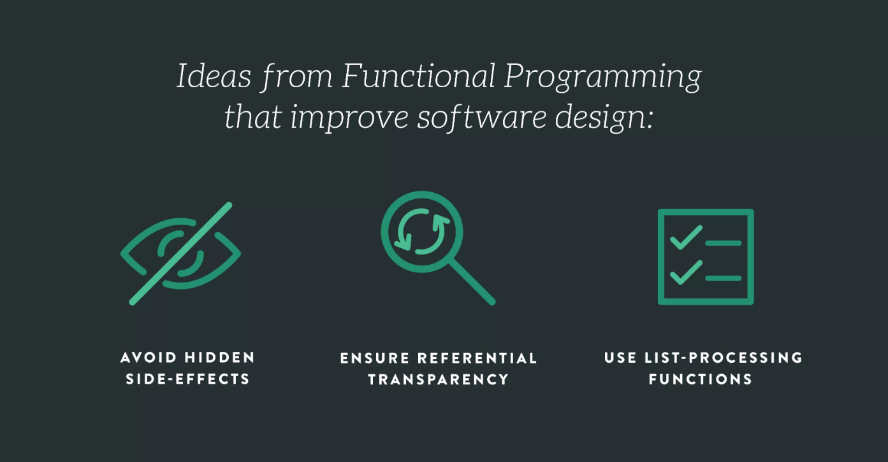

##

## If you think you know, you don't

I, like others in my position, think they know a fair amount of knowledge as they prepare to graduate.  I've worked with many algorithms and learned about the different ways to go about and solve them.  Certain Strategies that might be better to use in one situation than other.  Though this was the first time I've encountered functional programming.

When you think of coding, it's probably like this, imperative.

## Imperative
```
const numList = [1, 2, 3, 4, 5, 6, 7, 8, 9, 10];
let result = 0;
for (let i = 0; i < numList.length; i++) {
  if (numList[i] % 2 === 0) {
    result += numList[i] * 10;
  }
}
```
## Functional
```
const result = [1, 2, 3, 4, 5, 6, 7, 8, 9, 10]
               .filter(n => n % 2 === 0)
               .map(a => a * 10)
               .reduce((a, b) => a + b);
```
They both do the same thing but go about it in different ways.  I haven't used a lot of functinal programming myself.  I know it might not always be the best choice as because it is not as efficient with the CPU as imperative programming in most instances but seeing how it is implemented makes me realize that the "norm" of coding could change in the near future.  If not with functional programming then with something else, as we're always pushing the limits of how to make things better or effcient.  This makes me realize how I always have to improve and learn as I could get left behind quick, akin to Nokia and Smartphones.
  
 


## Working as a team
 Most of the time I was working alone.  Though there we're some group assignments but never using Agile Software Development.  My first time using the Agile method, it was hard to get used to, I've never put things on a task board before.  After using it though I realized how much I liked it.  The tasks didn't need to be large, they could be small, and anyone could pick to do whatever tasks were available/needed to do at the time.  It was my first introduction to a scrum board.
 
 With the Agile process things didn't seem so daunting as compared to the traditional Waterfall Method.  I didn't think of it as a huge project to finish, just little pieces.  In the Waterfall Method, you break down things down into pieces of course, but with the Agile process the feel of it is a lot different. I realized that this is what most companies will use in their software teams so I'm glad I got to get used to it before I go out in the real world.
