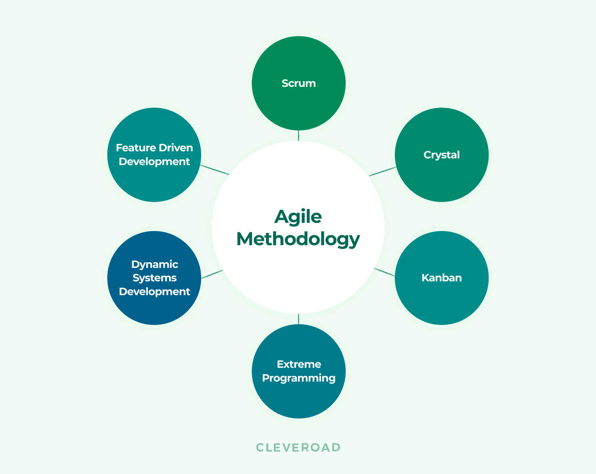

##

## If you think you know, you don't

As graduation approaches, I find myself reflecting on the breadth of knowledge I have gained and the programming concepts I have become familiar with. Algorithms and problem-solving strategies have become second nature to me. However, recently I encountered a new paradigm: functional programming.

When you think of coding, it's probably like this, imperative.

## Imperative
```
const numList = [1, 2, 3, 4, 5, 6, 7, 8, 9, 10];
let result = 0;
for (let i = 0; i < numList.length; i++) {
  if (numList[i] % 2 === 0) {
    result += numList[i] * 10;
  }
}
```
## Functional
```
const result = [1, 2, 3, 4, 5, 6, 7, 8, 9, 10]
               .filter(n => n % 2 === 0)
               .map(a => a * 10)
               .reduce((a, b) => a + b);
```
Both approaches achieve the same result but differ in their execution. While functional programming may not always be the most CPU-efficient choice, witnessing its implementation has made me realize that the coding landscape could shift in the near future. As technology constantly evolves, we continually explore ways to enhance efficiency and effectiveness. This realization drives me to continuously improve and stay adaptable, as remaining stagnant could result in being left behind, much like Nokia and the advent of smartphones.
  
 


## Working as a team
 Moreover, my experiences have not solely revolved around individual work. While most of my assignments were solitary endeavors, I did have opportunities to collaborate in group projects, particularly through Agile Software Development methodologies. Initially, adapting to Agile was a challenge. I had never used a task board before or fully embraced the concept of breaking down projects into manageable tasks. However, as I became acquainted with Agile practices, particularly scrum boards, I discovered how much I enjoyed this collaborative approach.

Agile's incremental nature made daunting projects more approachable. Rather than perceiving a massive undertaking, I learned to view it as a collection of smaller, achievable tasks. Unlike the rigid structure of the Waterfall Method, Agile allowed for flexibility and empowered team members to select and tackle tasks as needed. Recognizing that Agile is widely utilized in the software industry, I am grateful for the opportunity to familiarize myself with this approach before entering the professional realm.

## Conclusion
In conclusion, encountering functional programming has expanded my horizons and reinforced the need for continuous learning and adaptation in the ever-evolving world of coding. Likewise, embracing Agile methodologies has highlighted the power of collaboration and incremental progress. These experiences have shaped me into a more versatile and resilient computer engineer, ready to face future challenges and contribute meaningfully to the software development landscape.
