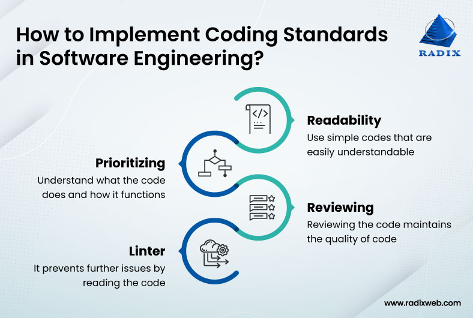

## Coding procedure
When you start to code you mimic the tutorials or people that you learned from.  You don't really question it you kind of just do.  I know when I started, it was normal to use the curly brackets for functions like this, or at least the class I was learning in.
```
functionName()
{
code here
}
```
Nowadays everyone puts the bracket right after the parenthesis such as 
```
functionName() {
code here
}
```
Yea in a sense it doesn't really matter, but if you add up a lot of things you don't really matter, it might end up mattering in the end, value-wise.  If you slowly make small positive changes the overall change might be drastic.


## Thinking about readability
Only towards the end of my tenure at the University did I really think about coding.  A professor got me thinking about function names and variables for readability.  Naming them in such a way that you would probably need very few comments and have the person reading them still able to understand what is going on and what stands for what.  Using this mentality, I started to think about how I code, following the standards would probably be a good start.  I wanted to think about good habits now because the longer I went on with any bad ones, it'd be harder to fix in the future.

## Using EsLint
The first time I used Eslint on code that I wrote it made me realize how much errors, while still compilable and runnable,  I have in my code.  Yea, some things I thought we're too nitpicky, such as spaces in certain areas.  Overtime I wasn't making much some of the same errors as I did before.  Thinking about it now, yea my code does look a bit cleaner.  

## Still working on my craft
I'm trying to incorporate the fixes suggested from EsLint into my future codes.  Still have a lot to learn and a lot to fix in my code.  My mindset changed initially from thinking the most important thing was the algorithm but readability is a key factor.  I haven't experienced it yet but once I get into the workforce I'll be looking and working with a lot of code.  If they never coded abiding to the standards then it might've been unreadable, at least to a fresh face looking at the code.  My goal to become a better Software Engineer just got a little bit closer with EsLint helping me fix some things early on.
