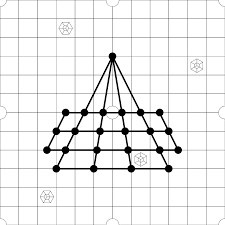

Huligatti is a traditional indian board game otherwise known as "goats and tigers".  You start the game with 3 tigers and 3 goats.  The goal of the Tigers is to eat the goats to produce more Tigers.   Tigers win when there are no more goats.  Goats win by staying alive and trapping Tigers so the Tigers can't move.  Goats win if there is still a goat alive after so many rounds.

<hr>

<pre>

For this project we designed the game in Python.  We would collect data on 
how the computer played the game.  Using information entropy, the AI would 
then be able to play the game optimally, making the best move, according 
to the algorithm, each turn.  

</pre>

<hr>

## Inverse Reinforcement Learning 
We created a cost function that would include the state of the board and the combinations of pairs on the board and if we had time it would take into accounts of triplets.

Here is a sample of some of the code

```
  def testCostFunction(Matr):
        adj_list1 = [0,0,0,0,1,2,3,4,5,1,2,3,4,5,6,7,8,9,10,11,7,8,9,10,11,12,13,14,15,16,17,14,15,16,17,19,20,21]
        adj_list2 = [2,3,4,5,2,3,4,5,6,7,8,9,10,11,12,8,9,10,11,12,13,14,15,16,17,18,14,15,16,17,18,19,20,21,22,20,21,22]
        corner_vals = [0,1,6,7,12,13,18,19,20,21,22]

        cost = 0

        #for x in range(0,22):
            #Corners only
            #if (x in corner_vals and Matr[x] == [1,0,0]): #if tiger in corner
            #    cost += 1
            #if (x in corner_vals and Matr[x] == [0,1,0]):
            #    cost += 2

        Matr = Matr.reshape(23,3,1,1)
        MatrT = np.transpose(Matr)

        Matr = Matr*MatrT

        T = [1,0,0]
        G = [0,1,0]
        E = [0,0,1]


        #print((Matr[adj_list1[0],:,:,adj_list2[0]]==np.outer(T,E)).all())
        #print(np.outer(T,T))

        for x in range(0,37):
            if((Matr[adj_list1[x],:,:,adj_list2[x]] == np.outer(T,G)).all()):
                cost += 4
            if((Matr[adj_list1[x],:,:,adj_list2[x]] == np.outer(G,G)).all()):
                cost += 1
            if((Matr[adj_list1[x],:,:,adj_list2[x]] == np.outer(G,E)).all()):
                cost += 4
            #if((Matr[adj_list1[x],:,:,adj_list2[x]] == np.outer(E,E)).all()):
            #    cost += 1
            if((Matr[adj_list1[x],:,:,adj_list2[x]] == np.outer(T,T)).all()):
                cost += 0
            if((Matr[adj_list1[x],:,:,adj_list2[x]] == np.outer(T,E)).all()):
                cost += 3

        return cost
```
