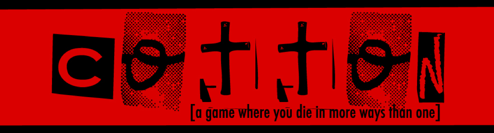

Wordle is a popular web-based word game.

<pre>

## How to play

In Wordle you are given a specific number of turns to guess the word that was chosen.  For each consecutive word you are given a different color in each letter block, they will either indicate if that letter exists at all, if it exists but in a different block, or if that letter exists in that specific block.  

</pre>

Source: <a href="https://github.com/jogarces/ics-313-text-game"><i class="large github icon "></i>jogarces/ics-313-text-game</a>

